# ENIGMA

Enigma is a website that aims to teach users about cryptography used during the Second World War. The site is intended for users who want to learn about the history surrounding that period for educational purposes.

The target audience is beginners learning about the war and the code breakers history for the first time, or for enthusiasts who would like to find more in depth knowledge on specific topics.

Enigma includes articles accompanied by historical photographs which elaborate on details of the overall story of the Enigma codes and cryptography as a whole during the war and years following after. Users can get a sense of the entire narrative on the Timeline page or visualize some of the characters, mechanisms and locations on the Gallery page. The site also includes a subscribe form for users to add their email address to a mailing list for a monthly newsletter which will include links to new articles and gallery content.

The live link can be found here - [Enigma](https://rodocode.github.io/enigma/)

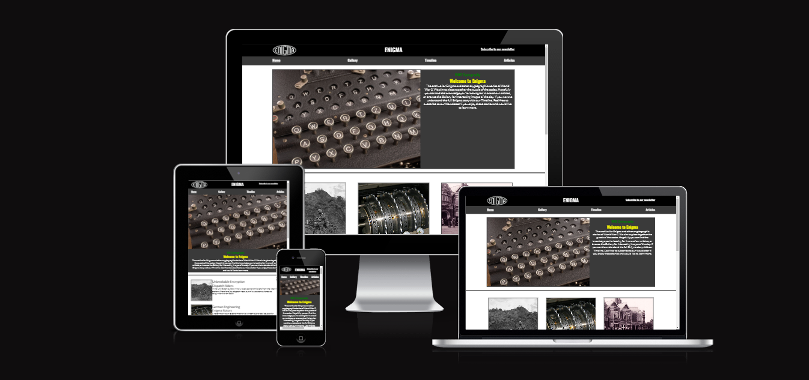

Searchers for this content may be children at school doing projects on the topic so the content is sensitive to this audience and avoids any specific content which might be disturbing or require parental guidance.

## Site Owner Goals

- To provide the user with information which is interesting, informative and, easy to understand so that users can easily learn from their time on the site.
- To provide the user with a clear picture of the whole story of Enigma and how the codes were broken.
- To present the user with a website that is intuitive to navigate, fully responsive and gives the feeling of accessing an archive of historical knowledge.
- To encourage users to want to sign up for the newsletter and learn more.

## User Stories

- ### First time user

  - As a first time user I want to understand the story which is being told and how to investigate further with this tool.
  - As a first time user I want to feel that I am absorbing the information at an easy comfortable pace.
  - As a first time user I want to see images with the story portions so I can picture what is being spoken about.

- ### Returning User

  - As a returning user I want to easily navigate to a specific article which I am interested in researching
  - As a returning user I want to find new details which I didn't learn on my first visit.
  - As a returning user I want to find my back to a particular image or article.

- ### Frequent User
  - As a frequent user I want to be able to sign-up to the Enigma newsletter in order to get updates on new articles on the website.
  - As a frequent user I want to be able to flip between article pages quickly to cross check dates of coinciding stories.

## Design

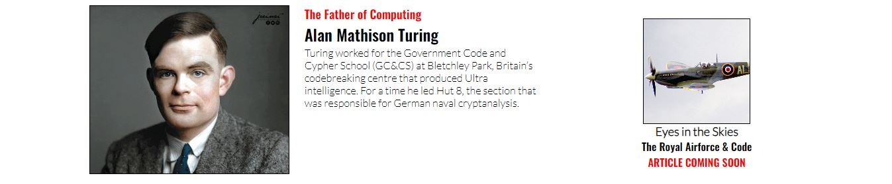

### Imagery

The photographs used in Enigma are integral to the site. These images speak a thousand words for the stories of the people captured in them. These images bring the story of WW2 to life and give site users a face they can empathize with and relate to.

### Colours

The colour scheme of Enigma is grey scale, using dark grey, #3a3a3a, with pops of red, rgb 0,0,255. This matches the styling of a lot of other historical sites and is a familiar colour palatte used in archival educational sites, this lets users inuitively feel the setting of the content. Helpfully this colour scheme allows for high contrast between text and backgrounds for easy on screen reading.

### Fonts

The Lato and Oswald fonts are the two fonts used across the website. Both are imported from [Google Fonts](https://fonts.google.com/). Sans Serif is the backup font, this allows the site cope with any import or compatibility issues with GoogleFonts.

## Wireframes

Balsamiq was use to generate the wireframes.

 

 
Desktop Wireframe

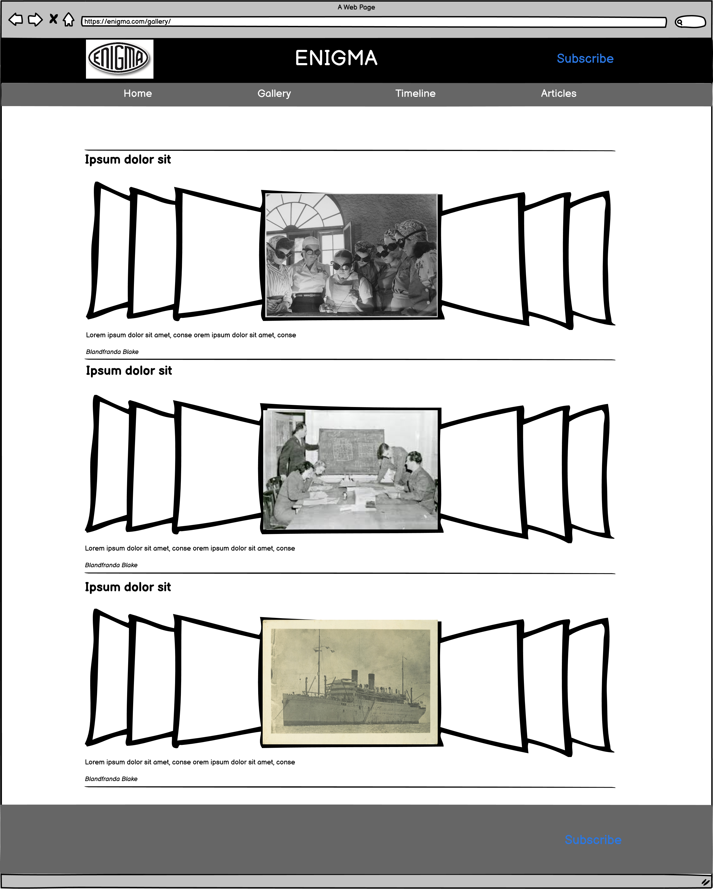

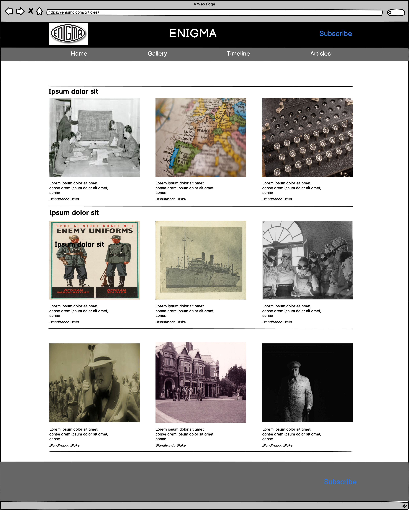
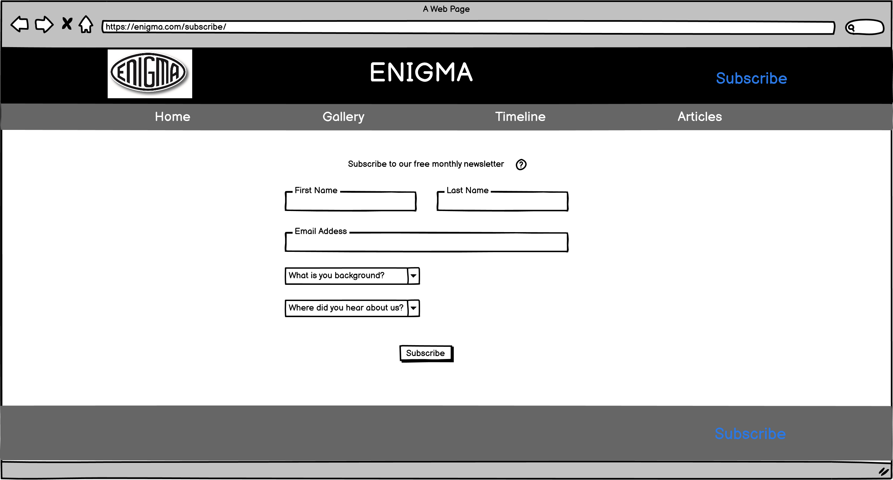

 

 

Mobile Wireframe

 

## Features

### Landing Page

This section introduces the user to ENIGMA with eye catching images to grab their attention and guide them on through the site. The page gives the user a rapid understanding of what the site is about and how they can use it. Users are met by a hero image with brief text introducing an interest and key element of the overall Enigma narrative.
There are different types of articles arrayed in several different sections to allow the user to feel how best they would like to learn.

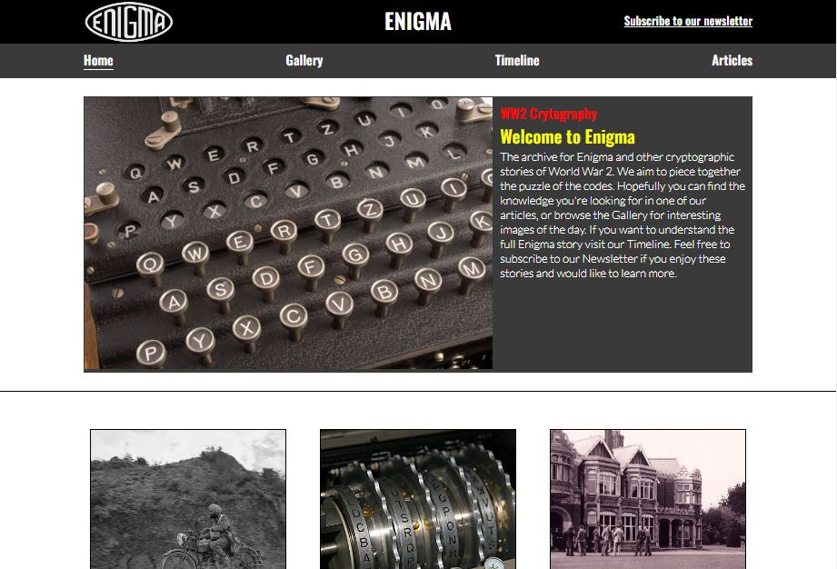

### Navigation Bar

Home, Gallery, Timeline, Articles - users come to the site with different levels of familiarity with the content so a range of different ways to navigate the content are crucial. Some allow the user to absorb and understand the content slowly as they navigate so that each section ahead makes sense while others are more direct for those that know what they are looking for.

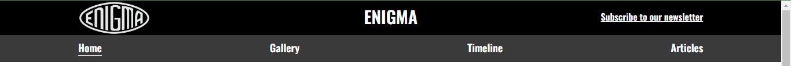

### Gallery

A collection of images with clear descriptions with hyperlinks to relevant pages where users can learn more. The images themselves are large and detailed, they are meant to be inspiring and interesting in and of themselves; a rare glimpse into the past.

### Timeline

A single page interactive info-graphic which the user can learn from and also use to navigate the site. The timeline will follow the start of the Enigma story through to it's conclusions with hyperlinks at each key stage which has a relevant page on the site

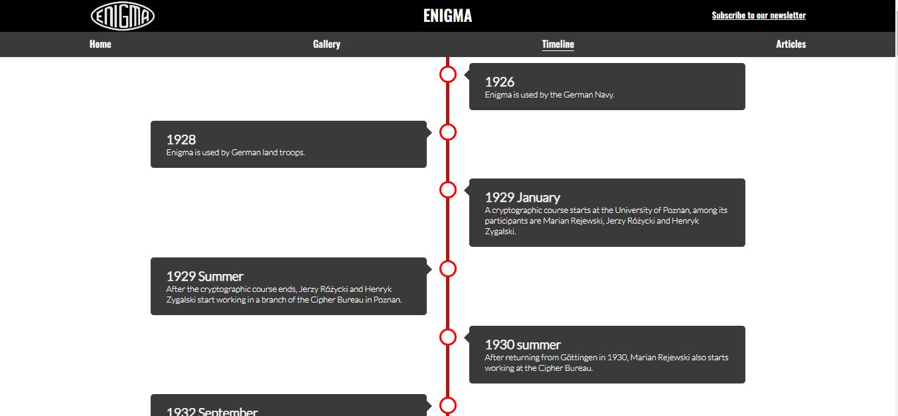

### Articles

This is a grid page with a list of all the pages on the site, titled clearly for a user who is more familiar with the topics or for anyone to explore at their leisure. Article pages cover key timeline periods with an overview of the narrative with links to more specific detailed pages

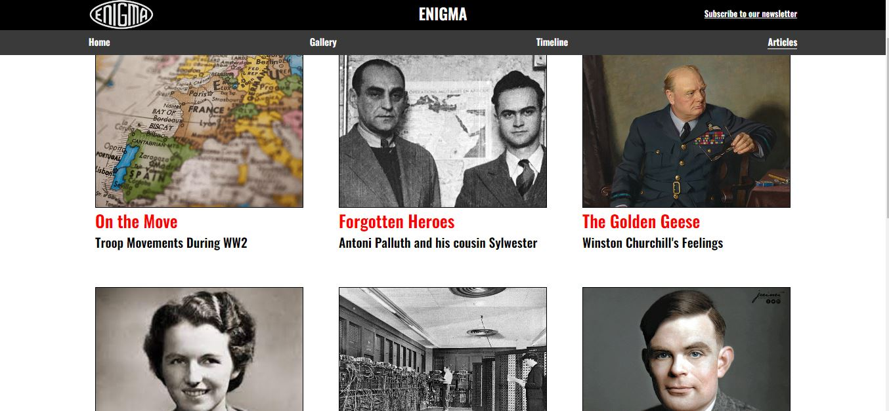

### Subscribe to Newsletter

A simple form which allows a user to sign up to a mailing list and to leave a little feedback with suggestions for amendments or additions to the site. There are several drop downs for the user to input their own email for follow up responses and also to define their background student/academic/expert

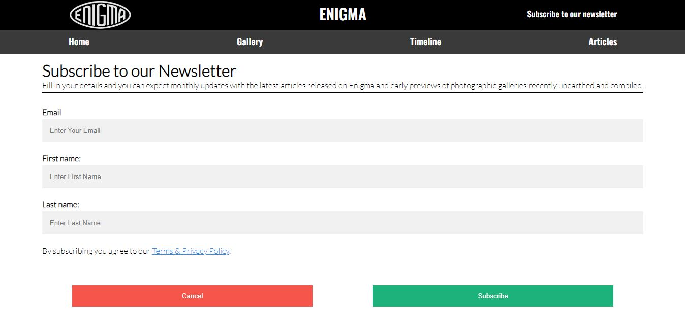

### The Footer

The footer section includes links to relevant social media sites for Enigma . The links will open to a new tab to allow easy navigation for the user.
The footer also include site navigation links so users don't have to scroll to the top of the page.

### Features Left to Implement

All of the articles this site would host are simply too numerous to curate and implement during this project. However there are adequate examples of all types of articles already included in this project so it is only the sheer quantity of stories and deep dive articles into this subject which the site is yet to implement fully.

## Testing

### Validator Testing

- #### HTML
  - No errors were returned when passing through the official W3C Markup Validator
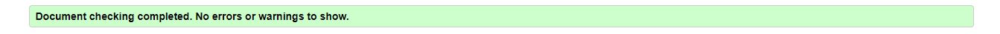
- #### CSS
  - No errors were found when passing through the official W3C CSS Validator

- #### Accessibility
  - The site achieved a Lighthouse accessibility score of 100% which confirms that the colours and fonts chosen are easy to read and accessible

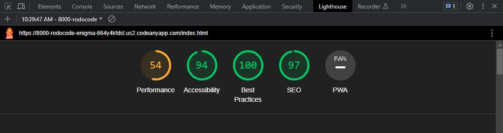

### Form Testing

- The subscription page has been tested to show that it will submit to the database, and only after required input fields have been filled in (full name and email address).

### Links Testing

Testing has been conducted on all features of the Enigma site up to its current status. All links lead to the relevant internal pages and external links, particularly for sources, have been tried and tested. Nav bar links have all been tested from each page to every other page. All social media links have also been tested.

### Browser Testing

- The Website was tested on Google Chrome, Firefox, Microsoft Edge, Safari browsers with no issues noted.

### Device Testing

The site has been tested via dev tools on the full range of screens available there. The pages are responsive to changes in the desktop window size. The site has been tested on: 1920x1080 monitor, 1082x1048 monitor and an iPhone 13 Pro Max screen.

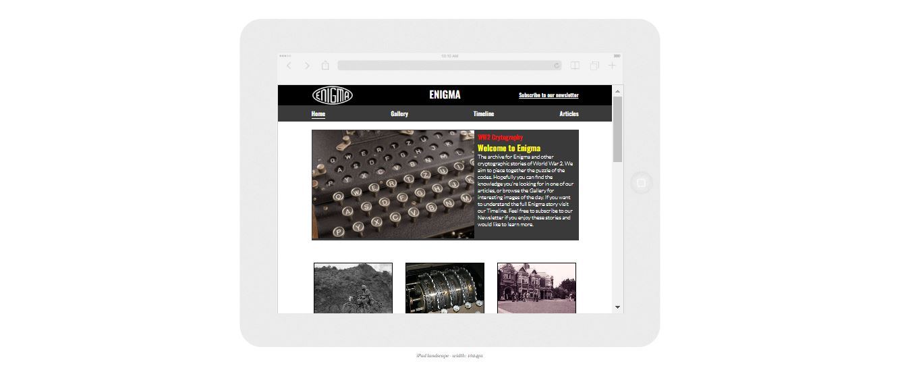

- I also used the following websites to test responsiveness:
  - [Responsinator](http://www.responsinator.com/?url=https%3A%2F%2Frodocode.github.io%2Fenigma%2F)
  - [Am I Responsive](https://ui.dev/amiresponsive?url=https://rodocode.github.io/enigma/)

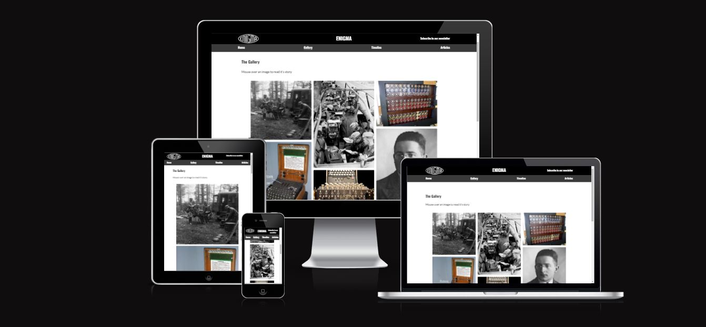  

### User Testing

Test users have been used and observed navigating the site unaided, and asked to find their way to specific pages without prior knowledge of how to get there. All test users successfully navigated to their targets after less than a minute and in fewer than 4 clicks.

### Bugs list:
- Bug with headers and footers not loading in the article sub pages: this turned out to be due to the pages being in a subfolder so requiring a "../" before each target address.
- Bug with margins in footer after media query changes the width of the footer for small screens: this was due to a property being carried without it being set to zero
- External links were opening in the same tab: they all required a blank target attribute to open a new tab when clicked.
- H-rules all disappeared without outdated attributes: had to add a border-top to make them visible.

### Unfixed Bugs

- Bug with the underline of the subscribe button meant that when it is removed and made to only appear during a hover action the underline becomes the entire width of the container and underlines one third of the screen. While I was keen to have this reactive feature on the subscribe button this was not integral to the user experience and I chose to remove the feature and to have fixed underlining making it clear the text is still a link. 

## Deployment

The site was deployed to GitHub pages. The steps to deploy are as follows:

1. In the GitHub repository, navigate to the Settings tab
2. Select 'Settings'
3. Select 'Pages'
4. Select the 'Branch' dropdown menu and select 'main'
5. Click 'Save'
6. Your site is now deployed (this is confirmed by a confirmation message)

The live link can be found here - [Enigma](https://rodocode.github.io/enigma/)

### Frameworks - Libraries - Programs Used

- [Am I Responsive](http://ami.responsivedesign.is/) - Used to verify responsiveness of website on different devices.
- [Balsamiq](https://balsamiq.com/) - Used to generate Wireframe images.
- [Chrome Dev Tools](https://developer.chrome.com/docs/devtools/) - Used for overall development and tweaking, including testing responsiveness and performance.
- [Font Awesome](https://fontawesome.com/) - Used for Social Media icons in footer.
- [GitHub](https://github.com/) - Used for version control and hosting.
- [Google Fonts](https://fonts.google.com/) - Used to import and alter fonts on the page.
- [Responsinator](http://www.responsinator.com/) - Used to verify responsiveness of website on different devices.
- [https://stackedit.io/app#] - Used to write Markdown for ReadMe
- [TinyPNG](https://tinypng.com/) - Used to compress images to reduce file size without a reduction in quality.
- [W3C](https://www.w3.org/) - Used for HTML & CSS Validation.

## Credits

### Thanks

My thanks to Antonio Rodriguez for his mentoring advice through this project. Lifesaver.

### Sources for article texts:

- https://www.nature.com/articles/d41586-018-06149-y#:~:text=In%201926%2C%20the%20German%20navy,set%20of%20bulbs%20on%20top.
- https://en.wikipedia.org/wiki/World_War_II_cryptography#:~:text=Cryptography%20was%20used%20extensively%20during,the%20latter%20using%20rotor%20machines.
- https://www.nature.com/articles/d41586-018-06149-y#:~:text=In%201926%2C%20the%20German%20navy,set%20of%20bulbs%20on%20top.
- https://enigma.umww.pl/en/enigma-timeline/
- https://www.historytoday.com/
- https://www.cryptomuseum.com/crypto/enigma/photo.htm
- https://en.wikipedia.org/wiki/Bletchley_Park
- https://en.wikipedia.org/wiki/Cryptanalysis_of_the_Enigma
- https://en.wikipedia.org/wiki/Bletchley_Park
- https://www.history.com/this-day-in-history/enigma-key-broken
- https://www.history.com/this-day-in-history/germans-get-enigma
- https://en.wikipedia.org/wiki/Despatch_rider
- http://www.teachinghistory100.org/objects/about_the_object/enigma_cipher_machine#:~:text=This%20Enigma%20machine%20is%20one,by%20the%20German%20armed%20forces.
- https://en.wikipedia.org/wiki/Bletchley_Park
- https://en.wikipedia.org/wiki/Enigma_machine
- https://www.nationalww2museum.org/war/articles/alan-turing-betchley-park
- https://www.scotsman.com/news/obituaries/obituary-mavis-batey-mbe-cryptologist-1552691
- https://en.wikipedia.org/wiki/ENIAC
- https://www.hp.com/ca-en/shop/offer.aspx?p=computer-history-all-about-the-eniac
- https://www.theguardian.com/world/2013/nov/20/mavis-batey
- https://www.britannica.com/place/Bletchley-Park
- https://www.britannica.com/place/Bletchley-Park
- https://www.ciphermachinesandcryptology.com/en/enigmatech.htm
- https://www.iwm.org.uk/history/spies-saboteurs-and-d-day

### Sources for images:

- https://www.ebay.ie/itm/163632516778
- https://stocksnap.io/photo/atlas-continent-E0X04K7JKH
- https://www.pexels.com/photo/statue-of-winston-churchill-standing-against-a-dark-background-16805416/
- https://www.rawpixel.com/image/6043378/photo-image-public-domain-free
- https://awl.com/news/alan-turning-computer-lgbtiq-trailblazer/
- https://www.gchq.gov.uk/information/how-codebreakers-helped-fight-battle-britain
- https://themilitarymuseums.ca/visit/events-and-exhibits/permanent-exhibits/enigma-machine

Some images were taken from their respective source articles. 

### Formatting Techniques used to advise
- https://css-tricks.com/almanac/properties/a/align-content/
- https://www.w3schools.com/howto/howto_css_timeline.asp
- https://stackoverflow.com/questions/5445491/height-equal-to-dynamic-width-css-fluid-layout
- https://stackoverflow.com/questions/67552405/flexbox-image-gallery-with-diffrent-sizes
- https://www.geeksforgeeks.org/how-to-set-space-between-the-flexbox/
- https://www.javatpoint.com/css-lists
- https://stackoverflow.com/questions/5445491/height-equal-to-dynamic-width-css-fluid-layout
- https://stackoverflow.com/questions/14263594/how-to-show-text-on-image-when-hovering
- https://www.w3schools.com/howto/howto_css_image_overlay.asp
- https://stackoverflow.com/questions/67052371/flexbox-text-overlay-when-hovering-an-image
- https://stackoverflow.com/questions/30992940/bring-div-to-front-on-fixed-position
- https://www.educative.io/answers/how-to-crop-an-image-in-css
- https://www.geeksforgeeks.org/html-hr-color-attribute/
- https://www.geeksforgeeks.org/how-to-wrap-the-text-around-an-image-using-html-and-css/
- https://www.yourhtmlsource.com/myfirstsite/basiclinks.html#:~:text=html%20in%20your%20directories%2C%20you,href%3D%22folder%2F%22%20.
- https://medium.com/@miguelznunez/how-to-create-a-responsive-image-grid-gallery-with-html-css-flexbox-1a4ea78f1ab3#id_token=eyJhbGciOiJSUzI1NiIsImtpZCI6IjY3NmRhOWQzMTJjMzlhNDI5OTMyZjU0M2U2YzFiNmU2NTEyZTQ5ODMiLCJ0eXAiOiJKV1QifQ.eyJpc3MiOiJodHRwczovL2FjY291bnRzLmdvb2dsZS5jb20iLCJuYmYiOjE2ODk0NjI2MjAsImF1ZCI6IjIxNjI5NjAzNTgzNC1rMWs2cWUwNjBzMnRwMmEyamFtNGxqZGNtczAwc3R0Zy5hcHBzLmdvb2dsZXVzZXJjb250ZW50LmNvbSIsInN1YiI6IjExNTM3ODU0NTIyMDY2MjQ1NTQ4MSIsImVtYWlsIjoicm9yeS5kb3dAaG90bWFpbC5jb20iLCJlbWFpbF92ZXJpZmllZCI6dHJ1ZSwiYXpwIjoiMjE2Mjk2MDM1ODM0LWsxazZxZTA2MHMydHAyYTJqYW00bGpkY21zMDBzdHRnLmFwcHMuZ29vZ2xldXNlcmNvbnRlbnQuY29tIiwibmFtZSI6IlJvcnkgRG93IiwicGljdHVyZSI6Imh0dHBzOi8vbGgzLmdvb2dsZXVzZXJjb250ZW50LmNvbS9hL0FBY0hUdGM2Y2dyRFhESTJUSkpsVXVMVVdUYUc2bnlPRkpTa0pxM0VvMWg1ai1rQzd1Zz1zOTYtYyIsImdpdmVuX25hbWUiOiJSb3J5IiwiZmFtaWx5X25hbWUiOiJEb3ciLCJpYXQiOjE2ODk0NjI5MjAsImV4cCI6MTY4OTQ2NjUyMCwianRpIjoiZTMxYzVlMmUwYWJkY2E1MDA5MGE1ODI3ODljMGZhNTEyYWQ4ODNmZSJ9.FW51iV-rAykT5hOjUnpRpN-MJVoEFrgPw_NkMjk6XwJoCHYEzIsFqvY9uxEtfkl4BGVUxzpJgsqjguCTFvwRvsDQjmLxjUD0So5VF6oDb20Cfz7SeGY6oKLdMYcWfvxrjxF6MFVqdiuVM6wv3PChZaQVc63OB2j465MYN33cg92k8KCFmXlcrvNLhyBYdVKGGyMdti248PkrzNcVg9lp9-Ey6a5DtGc6UQ4DSsqv_SW8wEJibKFAQ8r6W-7GkKPu4u3UKnF5W-x5Kw0HiDRG9Tm42SVOrmAAQSPAkRxRrZpKy_cdLO4fO-mST6MU6zdN0SDO_E6dv_zYcwIAgNoC8Q
-

